# ReadStorm 技术指南

> 本文档面向开发者与贡献者，详细介绍 ReadStorm 的技术背景、架构设计、核心组件及运行机制。

---

## 目录

- [1. 技术背景](#1-技术背景)
- [2. 技术栈](#2-技术栈)
- [3. 分层架构](#3-分层架构)
- [4. 领域模型](#4-领域模型)
- [5. 用例接口](#5-用例接口)
- [6. 基础设施实现](#6-基础设施实现)
- [7. 桌面 UI 层](#7-桌面-ui-层)
- [8. 依赖注入](#8-依赖注入)
- [9. 书源规则系统](#9-书源规则系统)
- [10. 核心流程](#10-核心流程)
  - [10.1 搜索流程](#101-搜索流程)
  - [10.2 下载流程](#102-下载流程)
  - [10.3 阅读流程](#103-阅读流程)
  - [10.4 书源编辑流程](#104-书源编辑流程)
- [11. 数据存储](#11-数据存储)
- [12. 构建与测试](#12-构建与测试)
- [13. 目录结构](#13-目录结构)

---

## 1. 技术背景

ReadStorm 是一款跨平台桌面小说阅读器，目标是让用户通过统一界面搜索、下载和阅读来自多个在线书源的小说内容。

项目面临的核心技术挑战：

- **多书源适配**：不同网站的 HTML 结构各异，需要灵活的内容提取方案
- **跨平台 UI**：需要在 Windows、Linux、macOS 上提供一致的原生体验
- **离线阅读**：下载的内容需要持久化存储，支持断点续传
- **可扩展性**：用户应能自定义书源，而无需修改代码

ReadStorm 通过 **规则驱动的 CSS 选择器提取** + **清洁架构分层** 解决这些挑战。

---

## 2. 技术栈

| 技术 | 版本 | 用途 |
|------|------|------|
| **.NET** | 10.0 | 运行时框架 |
| **C#** | 最新版本 | 开发语言 |
| **Avalonia UI** | 11.3.11 | 跨平台桌面 UI 框架 |
| **Semi.Avalonia** | 11.2.1 | Semi Design 风格主题 |
| **CommunityToolkit.Mvvm** | 8.2.1 | MVVM 基础库（ObservableObject、RelayCommand） |
| **AngleSharp** | 1.1.2 | HTML 解析与 CSS 选择器查询 |
| **Microsoft.Data.Sqlite** | 9.0.2 | SQLite 数据库驱动 |
| **Microsoft.Extensions.DependencyInjection** | 10.0.0 | 依赖注入容器 |
| **xUnit** | 2.9.3 | 单元测试框架 |

---

## 3. 分层架构

ReadStorm 采用 **清洁架构（Clean Architecture）** 四层设计，依赖方向严格从外层指向内层：

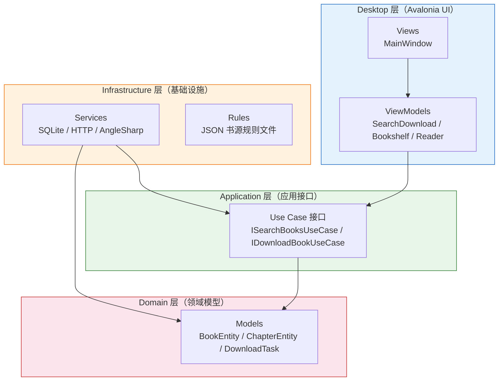

### 层间职责

| 层 | 职责 | 依赖 |
|----|------|------|
| **Domain** | 定义核心业务模型、枚举和值对象 | 无外部依赖 |
| **Application** | 定义用例接口（`ISearchBooksUseCase` 等） | → Domain |
| **Infrastructure** | 实现用例接口，处理 HTTP、HTML 解析、数据库 | → Application, Domain |
| **Desktop** | 提供 Avalonia UI 和 ViewModel | → Application, Infrastructure |

### 依赖关系图

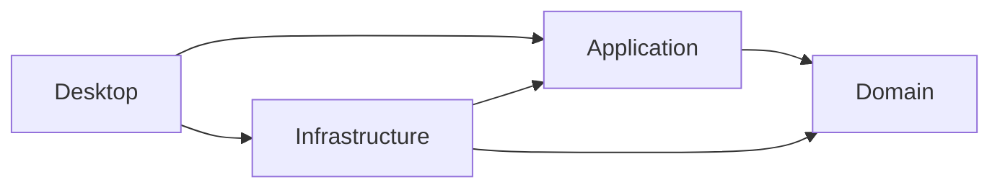

---

## 4. 领域模型

### 核心实体

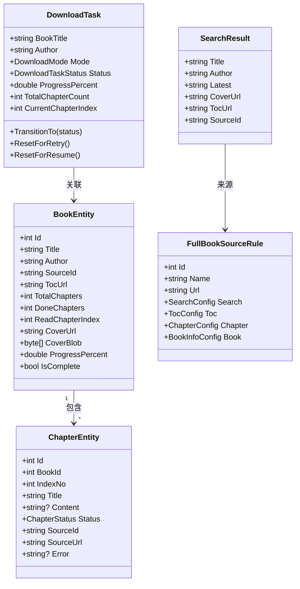

### 下载状态机

`DownloadTask` 使用严格的状态机管理下载生命周期：

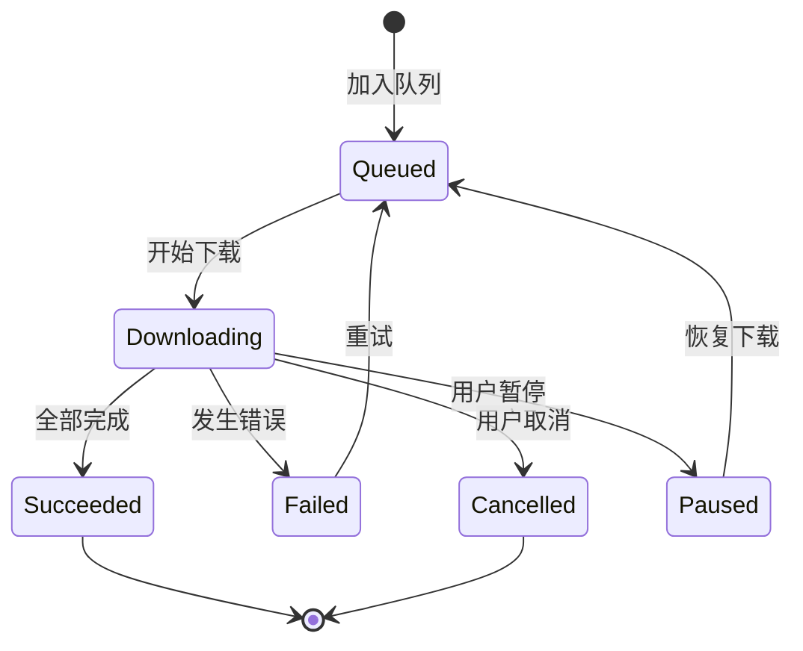

### 章节状态

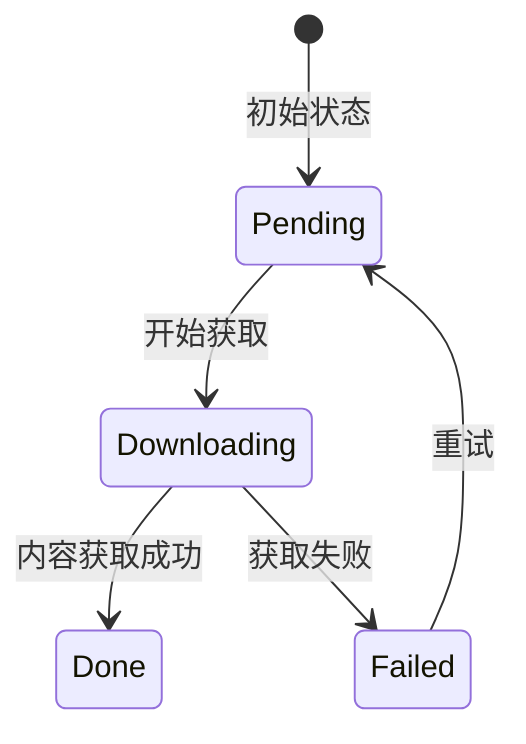

---

## 5. 用例接口

Application 层定义了所有业务操作的接口，供 Infrastructure 层实现、Desktop 层调用。

| 接口 | 职责 | 关键方法 |
|------|------|----------|
| `ISearchBooksUseCase` | 搜索小说 | `ExecuteAsync(keyword, sourceId?, ct)` |
| `IDownloadBookUseCase` | 下载管理 | `QueueAsync(...)`, `CheckNewChaptersAsync(...)`, `FetchChapterFromSourceAsync(...)` |
| `IBookRepository` | 书籍与章节持久化 | `UpsertBookAsync(...)`, `GetChaptersAsync(...)`, `UpdateReadProgressAsync(...)` |
| `IAppSettingsUseCase` | 应用设置读写 | `LoadAsync(ct)`, `SaveAsync(settings, ct)` |
| `IRuleCatalogUseCase` | 书源目录 | `GetAllAsync(ct)` → `IReadOnlyList<BookSourceRule>` |
| `ICoverUseCase` | 封面管理 | `RefreshCoverAsync(...)`, `ApplyCoverCandidateAsync(...)` |
| `ISourceDiagnosticUseCase` | 书源诊断 | `DiagnoseAsync(sourceId, keyword, ct)` |
| `ISourceHealthCheckUseCase` | 书源可达性检测 | `CheckAllAsync(sources, ct)` |
| `IBookshelfUseCase` | 书架管理 | `GetAllAsync(ct)`, `AddAsync(...)`, `RemoveAsync(...)` |
| `IRuleEditorUseCase` | 书源规则编辑 | `LoadAsync(id)`, `SaveAsync(rule)`, `TestSearchAsync(...)` |

---

## 6. 基础设施实现

### 6.1 HTML 解析（AngleSharp）

使用 AngleSharp 库通过 CSS 选择器从 HTML 页面中提取结构化数据。这是 ReadStorm 书源规则系统的核心。

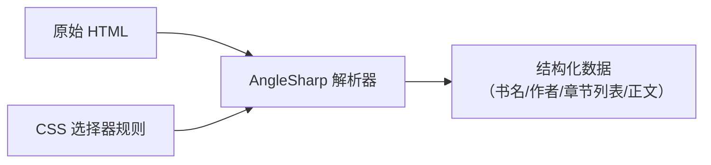

### 6.2 数据持久化（SQLite）

`SqliteBookRepository` 使用 WAL 模式实现线程安全的读写：

- **books 表**：书籍元数据、阅读进度、封面数据
- **chapters 表**：章节标题、内容文本、下载状态
- 写操作通过 `SemaphoreSlim` 保证串行化

### 6.3 HTTP 通信

`RuleHttpHelper` 提供统一的 HTTP 客户端管理：

- 自定义 User-Agent 模拟浏览器请求
- 支持 GET/POST 两种请求方式
- 带超时和重试机制

### 6.4 文件导出

| 导出器 | 格式 | 说明 |
|--------|------|------|
| 内置 TXT 导出 | `.txt` | 纯文本，章节标题 + 正文 |
| `EpubExporter` | `.epub` | 标准 EPUB 格式，含目录结构 |

### 6.5 辅助服务

| 服务 | 职责 |
|------|------|
| `RuleFileLoader` | 加载和规范化 JSON 规则文件 |
| `RulePathResolver` | 解析内置规则与用户规则目录 |
| `WorkDirectoryManager` | 管理应用数据目录路径 |
| `SourceDownloadQueue` | FIFO 下载队列，支持并发控制 |
| `AppLogger` | 文件日志记录 |

---

## 7. 桌面 UI 层

### 7.1 MVVM 架构

Desktop 层采用 MVVM 模式，通过 `CommunityToolkit.Mvvm` 实现数据绑定和命令：

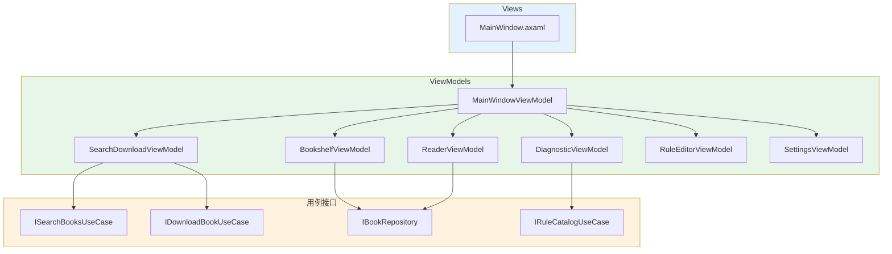

### 7.2 懒加载模式

`MainWindowViewModel` 采用延迟初始化策略：子 ViewModel 仅在用户首次切换到对应页签时才创建，降低启动开销。

### 7.3 页签功能

| 页签 | ViewModel | 功能 |
|------|-----------|------|
| 搜索下载 | `SearchDownloadViewModel` | 书源搜索、下载队列管理 |
| 书架 | `BookshelfViewModel` | 已下载书籍管理，网格/列表视图 |
| 阅读器 | `ReaderViewModel` | 小说阅读，目录导航，主题切换 |
| 书源诊断 | `DiagnosticViewModel` | 书源健康检查与诊断 |
| 书源编辑 | `RuleEditorViewModel` | 创建/编辑/测试书源规则 |
| 设置 | `SettingsViewModel` | 应用配置 |

---

## 8. 依赖注入

在 `App.axaml.cs` 中通过 `Microsoft.Extensions.DependencyInjection` 完成服务注册：

```csharp
private static ServiceProvider ConfigureServices()
{
    var services = new ServiceCollection();

    // 用例实现（单例，保持状态）
    services.AddSingleton<ISearchBooksUseCase, HybridSearchBooksUseCase>();
    services.AddSingleton<IDownloadBookUseCase, RuleBasedDownloadBookUseCase>();
    services.AddSingleton<IBookRepository, SqliteBookRepository>();
    services.AddSingleton<IAppSettingsUseCase, JsonFileAppSettingsUseCase>();
    services.AddSingleton<IRuleCatalogUseCase, EmbeddedRuleCatalogUseCase>();
    services.AddSingleton<ICoverUseCase>(sp => sp.GetRequiredService<CoverService>());
    services.AddSingleton<ISourceDiagnosticUseCase, RuleBasedSourceDiagnosticUseCase>();
    services.AddSingleton<ISourceHealthCheckUseCase, FastSourceHealthCheckUseCase>();
    services.AddSingleton<IBookshelfUseCase, JsonFileBookshelfUseCase>();
    services.AddSingleton<IRuleEditorUseCase, FileBasedRuleEditorUseCase>();

    // ViewModel（瞬态，每次创建新实例）
    services.AddTransient<MainWindowViewModel>();

    return services.BuildServiceProvider();
}
```

### 生命周期策略

- **Singleton**：有状态服务（数据库连接池、下载队列、设置缓存）
- **Transient**：ViewModel（每个窗口创建独立实例）

---

## 9. 书源规则系统

### 9.1 规则结构

每个书源通过一个 JSON 文件描述其 HTML 结构，ReadStorm 使用 CSS 选择器从页面中提取数据。

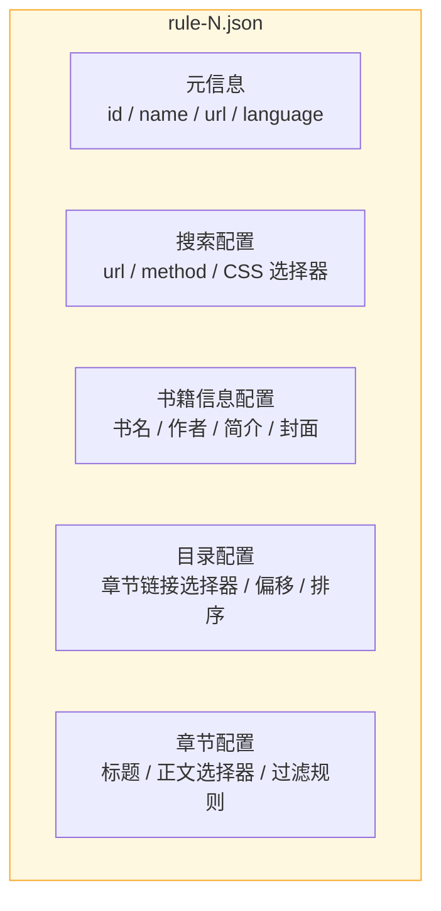

### 9.2 规则 JSON 示例

```json
{
  "id": 1,
  "url": "http://example.com/",
  "name": "示例书源",
  "type": "html",
  "language": "zh_CN",

  "search": {
    "url": "http://example.com/search",
    "method": "post",
    "data": "{searchkey: %s}",
    "result": "#results > table > tr",
    "bookName": "td.title > a",
    "author": "td:nth-of-type(3)",
    "latestChapter": "td.latest > a"
  },

  "book": {
    "bookName": "meta[property='og:novel:book_name']",
    "author": "meta[property='og:novel:author']",
    "intro": "meta[property='og:description']",
    "coverUrl": "meta[property='og:image']"
  },

  "toc": {
    "item": "#chapter-list > dd > a",
    "offset": 0,
    "desc": false
  },

  "chapter": {
    "title": ".chapter-title > h1",
    "content": "#chapter-content",
    "paragraphTag": "<br>+",
    "filterTxt": "广告文本正则",
    "filterTag": "div script"
  }
}
```

### 9.3 规则加载优先级

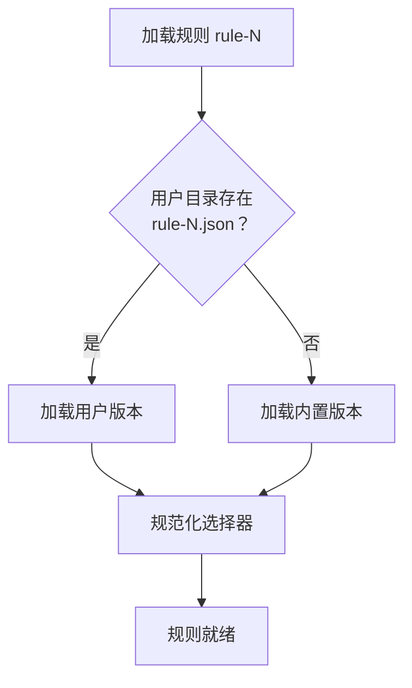

- **内置规则**：`src/ReadStorm.Infrastructure/rules/` 下的 20 个 JSON 文件，编译时嵌入程序集
- **用户规则**：`{工作目录}/rules/` 下的同名文件，优先级高于内置规则
- 用户可通过规则编辑器修改后保存到用户目录，也可重置为内置默认版本

---

## 10. 核心流程

### 10.1 搜索流程

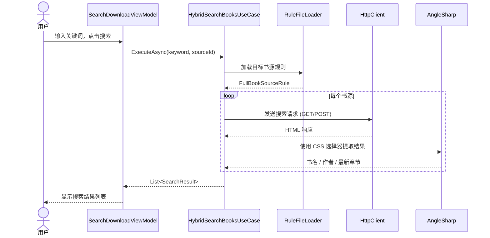

### 10.2 下载流程

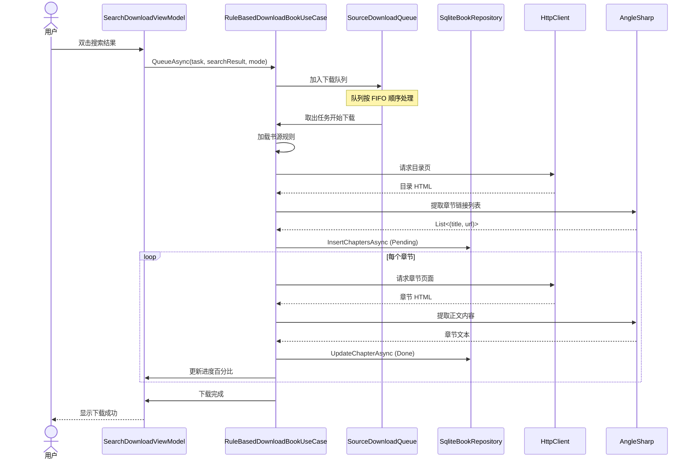

### 10.3 阅读流程

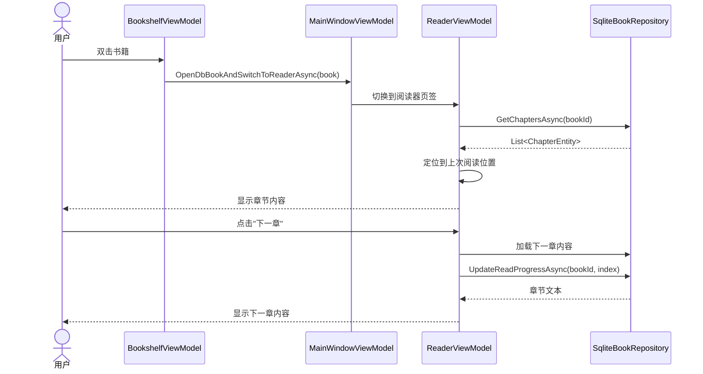

### 10.4 书源编辑流程

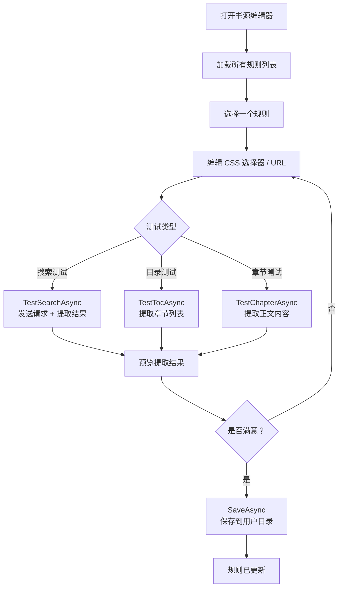

---

## 11. 数据存储

### 11.1 工作目录

应用数据统一存放在用户专属目录中：

| 平台 | 路径 |
|------|------|
| Windows | `%APPDATA%\ReadStorm\` |
| Linux | `~/.readstorm/` |
| macOS | `~/.readstorm/` |

### 11.2 目录结构

```
{工作目录}/
├── ReadStorm.db          # SQLite 数据库
├── settings.json         # 应用设置
├── rules/                # 用户自定义规则（可选）
│   └── rule-N.json
└── logs/                 # 运行日志
    └── download-YYYY-MM-DD.log
```

### 11.3 数据库表结构

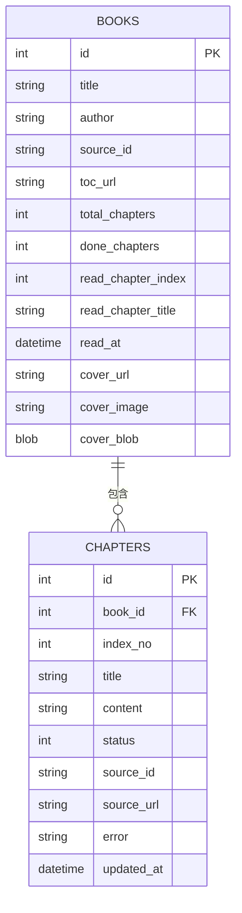

---

## 12. 构建与测试

### 12.1 构建

```bash
# 还原依赖并编译
dotnet build ReadStorm.slnx

# 发布（以 Windows x64 为例）
dotnet publish src/ReadStorm.Desktop -c Release -r win-x64
```

### 12.2 测试

```bash
# 运行全部测试
dotnet test ReadStorm.slnx

# 仅运行特定测试类
dotnet test ReadStorm.slnx --filter "FullyQualifiedName~EnhancedFeatureTests"
```

### 12.3 测试原则

项目遵循以下测试原则（详见 `tests/TESTING_PRINCIPLE.md`）：

- 测试调用**真实主项目代码**，通过 `ProjectReference` 引用
- 测试发现与执行自动化，测试用例由开发者手动编写
- 覆盖：状态机逻辑、持久化操作、规则解析、下载管线
- 不覆盖：外部 API 变化、平台特定 UI、性能指标

---

## 13. 目录结构

```
ReadStorm/
├── ReadStorm.slnx                           # 解决方案文件
├── README.md                                # 项目简介
├── LICENSE                                  # MIT 许可证
├── RELEASE_NOTES.md                         # 发行说明
│
├── src/
│   ├── ReadStorm.Domain/                    # 领域层
│   │   └── Models/
│   │       ├── BookEntity.cs                #   书籍实体
│   │       ├── ChapterEntity.cs             #   章节实体
│   │       ├── DownloadTask.cs              #   下载任务状态机
│   │       ├── SearchResult.cs              #   搜索结果
│   │       ├── BookSourceRule.cs            #   书源元数据
│   │       ├── FullBookSourceRule.cs         #   完整书源规则
│   │       ├── AppSettings.cs               #   应用设置
│   │       └── ...                          #   枚举与值对象
│   │
│   ├── ReadStorm.Application/               # 应用层
│   │   └── Abstractions/
│   │       ├── ISearchBooksUseCase.cs       #   搜索用例接口
│   │       ├── IDownloadBookUseCase.cs      #   下载用例接口
│   │       ├── IBookRepository.cs           #   数据仓储接口
│   │       └── ...                          #   其他用例接口
│   │
│   ├── ReadStorm.Infrastructure/            # 基础设施层
│   │   ├── Services/
│   │   │   ├── SqliteBookRepository.cs      #   SQLite 仓储实现
│   │   │   ├── RuleBasedDownloadBookUseCase.cs  # 下载引擎
│   │   │   ├── HybridSearchBooksUseCase.cs  #   混合搜索实现
│   │   │   ├── EpubExporter.cs              #   EPUB 导出
│   │   │   └── ...                          #   其他服务实现
│   │   └── rules/                           #   内置书源规则
│   │       ├── rule-1.json ~ rule-20.json
│   │       └── rule-template.json
│   │
│   └── ReadStorm.Desktop/                   # 桌面 UI 层
│       ├── App.axaml.cs                     #   DI 配置与启动
│       ├── Views/
│       │   └── MainWindow.axaml.cs          #   主窗口
│       └── ViewModels/
│           ├── MainWindowViewModel.cs       #   根 ViewModel
│           ├── SearchDownloadViewModel.cs   #   搜索下载
│           ├── BookshelfViewModel.cs        #   书架
│           ├── ReaderViewModel.cs           #   阅读器
│           └── ...                          #   其他 ViewModel
│
├── tests/
│   └── ReadStorm.Tests/                     # 测试项目
│       ├── DownloadPipelineIntegrationTests.cs  # 集成测试
│       └── EnhancedFeatureTests.cs          # 功能测试
│
└── docs/
    └── TechnicalGuide.md                    # 本文档
```
